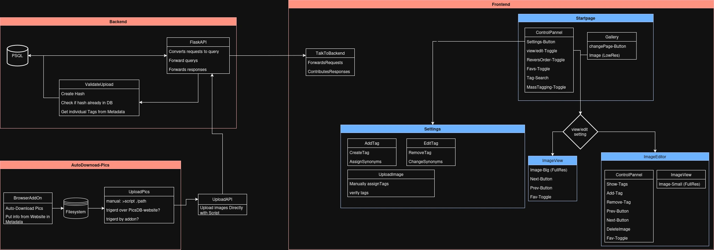
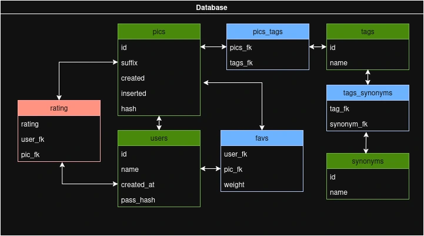

# Concept
## Overview

### Programm
Every Frontend-Container gets its own rout, to make navigation and understanding easier  
Frontend-Routs:
- Startpage as **Gallery**
- **Settings**
- **ImageView**
- **ImageEditor**

### Database
**green** is fundamental table  
**blue** is mapping table  
**red** are tables im not sure I should implement (but are easy to add later)

## Languages/Frameworks

### Frontend
In the frontend I will use JavaScript with React

### Backend
In the backend I use Python with Flask

## Conventions
- **Constant** variables in all **CAPS**
- **Filenames** and **Clases** will be in **PascalCase**
- **variables** and **functions** in **camelCase**
